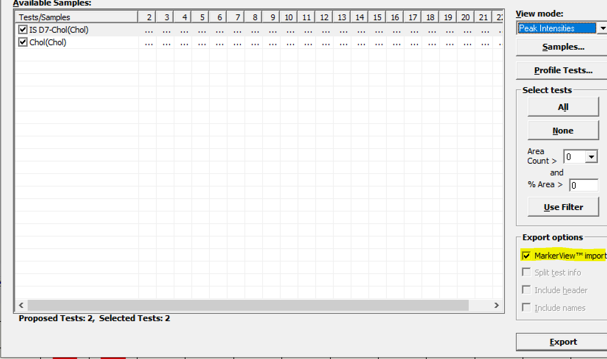

<!-- README.md is generated from README.Rmd. Please edit that file -->

# ShinyLipidcountr </a>

<!-- badges: start -->

[](https://codecov.io/gh/luechtian/ShinyLipidcountr)
<!-- badges: end -->

The goal of ShinyLipidcountr is to build an excel workbook that contains
quantified lipidomics data and graphs. The shiny app is able to read
LipidView and LipidXplorer report files to calculate concentrations of
various lipid species.

## Installation

You can install the development version of ShinyLipidcountr from
[GitHub](https://github.com/) with:

``` r
# install.packages("devtools")
devtools::install_github("luechtian/ShinyLipidcountr")
```

## Getting started

You need LipidView or LipidXplorer for peak processing and annotation of
your mass spectrometric data. This app accepts text-files and csv-files
with a specific format.

For LipidView-output, use target lists and only the “MarkerView” export
option in LipidView </a>

## 

A LipidView-textfile in a spreadsheet looks like this:
</a>

You can also embed plots, for example:


In that case, don’t forget to commit and push the resulting figure
files, so they display on GitHub and CRAN.
